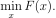
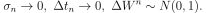
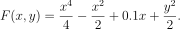
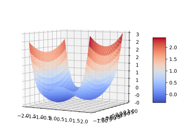

# Stochastic Descent Algorithms

The idea is to add a Gaussian noise to a descent algorithm in order to converge to the global minimum. Three algorithms are coded  :
1. Gradient Descent with noise
2. Momentum 1 (Langevin)
3. Momentum 2.

## Introduction

The goal of this repository is to find the global minimum of a non-convex function



To attain a global minimum we add a noise to three different descent algorithms.
This is called simulated annealing. For each algorithms in order to converge to global mimnium we need



For example let us pick a non convex function



The plot of F is as follows:



We can see that F has a global minimum at (x_1 < 0,0) and local minimum at (x_2 > 0,0). To make it complicated, let us choose for the initial guess (1,1) (which is in the wrong basin). We obtain the following results:

<center>

<table>
<tbody>
<tr>
<td>**Algorithm**</td>
<td>(x,y)</td>
<td>F(x,y)</td>
</tr>
<tr>
<td>Gradient Descent</td>
<td>[ 0.94 , 0]</td>
<td>-0.152</td>
</tr>
<tr>
<td>Gradient Descent with Noise</td>
<td>[ -1.04 , 0]</td>
<td>-0.35</td>
</tr>
<tr>
<td>Momentum 1</td>
<td>[ -1.04 , 0]</td>
<td>-0.35</td>
</tr>
<tr>
<td>Momentum 2</td>
<td>[ -1.04 , 0]</td>
<td>-0.35</td>
</tr>

</tbody>

</table>

</center>

The table shows that the regular gradient converges to a local minimum while our algorithms with noise converges to the global minimum.

## Gradient descent with noise


```python
"""
  Gradient Descent with Noise Algorithm
  PARAMETERS:
  -----------
     * Func : callable
              Function to minimize
     * Jac  : callable
              Jacobian of the function to minimize
     * gamma : float
              Real number that divide the gradient
     * amp :  float
              Real number, amplitude of the noise
     * tol :  flaot
              Real number, tolerance for the convergence
     * x_init  : ndarray
              Initial guess of x
     * itmax  : int
              maximum number of iteration
     * K  : int
              number of times to repeat the algorithm
     * it_init : int, optional
              iteration number where to start the algorithm
     * bounds : sequence
               dimension 2 where each value of x has to be between
     * DirDoF : list of tuple
              degree(s) of freedom where x will not change
   RETURNS:
   -------
     * x  : ndarray
          value of x where Func(x) is the minimum, same size of x_init
     * min_Func : flaot
          value of the minimum of Func(x)
     * min_it : int
          iteration number where the algorithm stopped
  """
```

```python
import numpy as np
from stdsct import *


def f(xt):
  return 0.5*xt[0]**2.0+0.5*(1.0-np.cos(2*xt[0]))+xt[1]**2.0


def df(xt):
  return np.array([2.0*0.5*xt[0]+2.0*0.5*np.sin(2*xt[0]), 2.0*xt[1]])

K = 10
itmax = 1000
tol = 1E-5
gamma = 1.0
amp = 1.0
x0 = np.array([3.0, -5.0])
v0 = np.copy(x0)
z0 = np.copy(x0)

[x1, min1, it1] = GradientNoise(f, df, gamma, amp, tol, x0, itmax, K)
```


## Momentum 1


```python
"""
  Momentum 1 Algorithm
  PARAMETERS:
  -----------
     * Func : callable
              Function to minimize
     * Jac  : callable
              Jacobian of the function to minimize
     * lda : float
              value is between 0 and 1
     * gamma : float
              Real number that divide the gradient
     * amp :  float
              Real number, amplitude of the noise
     * tol :  flaot
              Real number, tolerance for the convergence
     * x_init  : ndarray
              Initial guess of x
     * v_init  : ndarray
              Initial guess for Momentum 1 (velocity), same shape as x0
     * itmax  : int
              maximum number of iteration
     * K  : int
              number of times to repeat the algorithm
     * it_init : int, optional
              iteration number where to start the algorithm
     * bounds : sequence
               dimension 2 where each value of x has to be between
     * DirDoF : list of tuple
              degree(s) of freedom where x will not change
   RETURNS:
   -------
     * x  : ndarray
          value of x where Func(x) is the minimum, same size of x_init
     * v  : ndarray
          value of Momentum 1 (velocity)
     * min_Func : flaot
          value of the minimum of Func(x)
     * min_it : int
          iteration number where the algorithm stopped
  """
```

```python
import numpy as np
from stdsct import *


def f(xt):
  return 0.5*xt[0]**2.0+0.5*(1.0-np.cos(2*xt[0]))+xt[1]**2.0


def df(xt):
  return np.array([2.0*0.5*xt[0]+2.0*0.5*np.sin(2*xt[0]), 2.0*xt[1]])


K = 10
itmax = 1000
tol = 1E-5
lda = 0.1
gamma = 1.0
amp = 1.0
x0 = np.array([3.0,-5.0])
v0 = np.copy(x0)
z0 = np.copy(x0)

[x, v, min, it] = Momentum1(f, df, lda, gamma, amp, tol, x0, v0, itmax,K)
```

## Momentum 2


```python
"""
  Momentum 2 Algorithm
  PARAMETERS:
  -----------
     * Func : callable
              Function to minimize
     * Jac  : callable
              Jacobian of the function to minimize
     * lda : ndarray
              vector of dimension 3 where each value is  between 0 and 1
     * gamma : float
              Real number that divide the gradient
     * amp :  float
              Real number, amplitude of the noise
     * tol :  flaot
              Real number, tolerance for the convergence
     * x_init  : ndarray
              Initial guess of x
     * v_init  : ndarray
              Initial guess for Momentum 1 (velocity), same shape as x0
     * z_init : ndarray
              Initial guess for Momentum 2, same shape as x0
     * itmax  : int
              maximum number of iteration
     * K  : int
              number of times to repeat the algorithm
     * it_init : int, optional
              iteration number where to start the algorithm
     * bounds : sequence
               dimension 2 where each value of x has to be between
     * DirDoF : list of tuple
              degree(s) of freedom where x will not change
   RETURNS:
   -------
     * x  : ndarray
          value of x where Func(x) is the minimum, same size of x_init
     * v  : ndarray
          value of Momentum 1 (velocity)
     * z : ndarray
          value ofMomentum 2
     * min_Func : flaot
          value of the minimum of Func(x)
     * min_it : int
          iteration number where the algorithm stopped
  """
```

```python
import numpy as np
from stdsct import *


def f(xt):
  return 0.5*xt[0]**2.0+0.5*(1.0-np.cos(2*xt[0]))+xt[1]**2.0


def df(xt):
  return np.array([2.0*0.5*xt[0]+2.0*0.5*np.sin(2*xt[0]), 2.0*xt[1]])


K = 10
itmax = 1000
tol = 1E-5
lda = [0.1, 0.1, 0.1]
gamma = 1.0
amp = 1.0
x0 = np.array([3.0, -5.0])
v0 = np.copy(x0)
z0 = np.copy(x0)

[x, v, z, min, it] = Momentum2(f, df, lda, gamma, amp, tol, x0, v0, z0, itmax, K)
```

## References

*   [Recursive Stochastic Algorithms for Global Optimization in R^d](https://dspace.mit.edu/bitstream/handle/1721.1/3174/P-1937-20940740.pdf?sequence=1)
*   [Diffusion For Global Optimization in R**](http://epubs.siam.org/doi/abs/10.1137/0325042)
*   [Ergodicity for SDEs and approximations: locally Lipschitz vector fields and degenerate noise](https://www.sciencedirect.com/science/article/pii/S0304414902001503)
